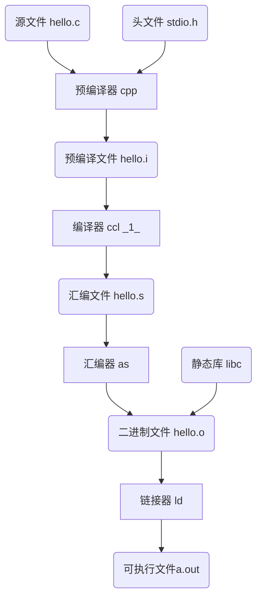

## C 语言编译过程

```c
# 文件名 hello.c
#include <stdio.h>

int main(int argc, char *argv[])
{
    printf("hello world\n");

    return 0;
}
```

Linux 下我们使用 GCC 来编译hello world程序，只需要使用最简单的命令:

```bash
$ gcc hello.c
$ ./a.out
hello world
```

事实上，上述过程分解为4个步骤，分别是预处理、编译、汇编、链接，如图1-1所示。



图 1-1 GCC 编译过程分解

### 预编译

```bash
$ gcc -E hello.c -o hello.i
或者
$ cpp hello.c > hello.i
```

预编译过程需要展开所有关于 “#” 开头的预编译指令，去除所有注释，添加行号

### 编译

```bash
$ gcc -S hello.i -o hello.s
```

```mermaid
graph TD
A(源代码) --> B(符号) :扫描
语法分析
语义分析
源代码优化
代码生成
目标代码优化

```

词法分析（转换成符号) 语法分析（分析符号格式错误） 语义分析 （类型错误）