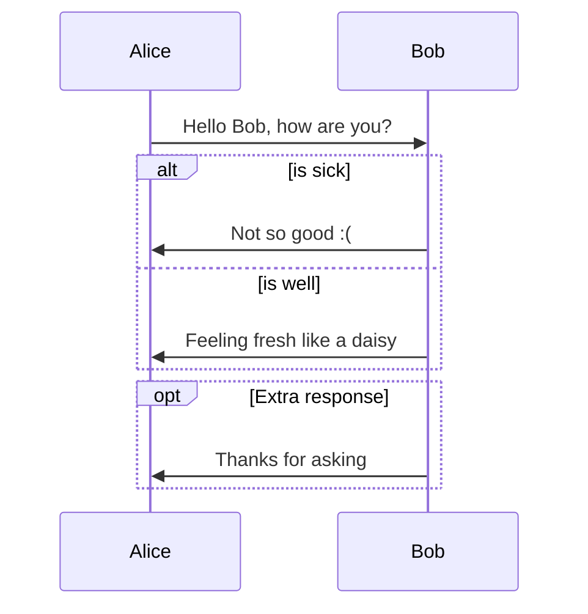

```c
#include <stdio.h>

int main(int argc, char *argv[])
{
    printf("hello world\n");
    
    return 0;
}
```

$$
sin^2x + cos^2x = 1
$$


```sequence
Alice->Bob: Hello Bob, how are you?
Note right of Bob: Bob thinks
Bob-->Alice: I am good thanks!
```


```flow
st=>start: Start
op=>operation: Your Operation
cond=>condition: Yes or No?
e=>end

st->op->cond
cond(yes)->e
cond(no)->op
```





```sequence
participant 客户端
participant 服务器
participant 通行证中心
Note over 客户端: 用户输入通行证的账号、密码
客户端->通行证中心: 发送账号、密码
Note over 通行证中心: 验证账号、密码
通行证中心-->>客户端: 返回token
客户端->服务器: 发送token
服务器->通行证中心: 验证token
通行证中心-->>服务器: 验证成功
服务器-->>客户端: 登陆成功
```


```sequence
用户-->小程序: 用户进入小程序
小程序-->小程序: 生成订单，third_session
小程序-->钱包服务: 发送 订单号及third_session
钱包服务-->微信开发后台服务: 传递参数[1] 到 /payment
微信开发后台服务-->微信开发后台服务: 将参数进行签名
微信开发后台服务-->微信服务: 调用支付统一下单API（）
微信服务-->微信开发后台服务:返回预付清单preapy_id等信息
微信开发后台服务-->微信开发后台服务: 将参数[2]数据签名
微信开发后台服务-->钱包服务:返回支付参数[3]
钱包服务-->小程序:返回支付参数
用户-->小程序:用户确认支付
Note over 小程序: 展示支付结果
小程序-->手机微信: 鉴权调起支付
手机微信-->小程序: 返回支付结果
```


- [1]  header 携带 thirdsession  订单号  body,total_fee, spbill_create_ip, trade_type, detail, notify_url
- [2] （appId、timeStamp、nonceStr、package、signType）preapy_id
- [3] （timeStamp、nonceStr、package、signType、paySign）
